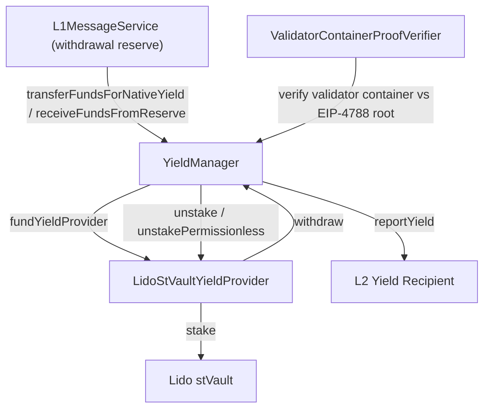

# Yield Management

> Earning yield on bridged ETH via Lido staking, with on-chain withdrawal reserve management and validator proof verification.

> Canonical spec: <https://hackmd.io/@kyzooroast/Hk7DQXH6lx>. This document is a plain-language overview. If it conflicts with the spec, the spec governs. Safety and liveness properties are stated precisely there; descriptions here may paraphrase and are not standalone security guarantees.

## Overview

Users bridge ETH from Ethereum L1 into Lineth. Instead of letting it sit idle, Lineth stakes the surplus in Lido V3 stVaults and reports the earned yield to L2 for distribution. The ETH kept on L1 - held by the `L1MessageService` contract - is the withdrawal reserve that pays out bridge redemptions. Under normal operation an automation service rebalances the reserve between configured minimum and target levels; if it falls into deficit, anyone can permissionlessly trigger replenishment, and a last-resort LST withdrawal path remains available to users.

### Safety and liveness

Safety properties - must hold at all times:

- Yield reports exclude all accumulated system obligations from the amount sent to L2.
- User principal (L1 deposits plus L2 circulating ETH) is never used to settle obligations; obligations are paid only from unreported yield.
- New beacon-chain deposits are paused whenever the reserve is in deficit, stETH liabilities are outstanding, or ossification (a permanent freeze of a yield provider) is initiated or completed.

Liveness properties - must eventually hold, though timing is not guaranteed:

- At least one withdrawal path stays available to users, even if delayed. Permissionless unstaking and reserve replenishment activate during reserve deficits, and replenishment takes precedence over repaying obligations.
- Vault accounting reports are refreshed at least every 48 hours; stale reports block withdrawals and LST minting until updated.

## Components

| Component | Path | Role |
|-----------|------|------|
| YieldManager | `contracts/src/yield/YieldManager.sol` | Core yield orchestration, reserve management |
| LidoStVaultYieldProvider | `contracts/src/yield/LidoStVaultYieldProvider.sol` | Lido stVault integration |
| LidoStVaultYieldProviderFactory | `contracts/src/yield/LidoStVaultYieldProviderFactory.sol` | Factory for deploying yield providers |
| YieldProviderBase | `contracts/src/yield/YieldProviderBase.sol` | Abstract yield provider interface |
| ValidatorContainerProofVerifier | `contracts/src/yield/ValidatorContainerProofVerifier.sol` | Beacon chain validator proof verification |
| LinethRollupYieldExtension | `contracts/src/rollup/LinethRollupYieldExtension.sol` | Integrates YieldManager into LinethRollup |
| SSZ/GIndex libs | `contracts/src/yield/libs/` | Beacon chain SSZ proof helpers |

## Architecture

## Withdrawal Reserve

The reserve system uses four parameters:

| Parameter | Description |
|-----------|-------------|
| `minimumWithdrawalReservePercentageBps` | Minimum reserve as % of user funds (basis points) |
| `minimumWithdrawalReserveAmount` | Minimum reserve as absolute ETH amount |
| `targetWithdrawalReservePercentageBps` | Target reserve % (higher than minimum) |
| `targetWithdrawalReserveAmount` | Target reserve absolute amount |

The effective reserve is `max(percentageBased, absoluteAmount)`. When the reserve drops below the minimum threshold, anyone may call `replenishWithdrawalReserve` to permissionlessly withdraw ETH from yield providers into the `L1MessageService`, restoring the reserve up to the target (not just the minimum). The call is only available while the reserve is in deficit.

## Roles

| Role | Purpose |
|------|---------|
| `YIELD_PROVIDER_STAKING_ROLE` | Stake ETH into yield providers |
| `YIELD_PROVIDER_UNSTAKER_ROLE` | Unstake from yield providers |
| `YIELD_REPORTER_ROLE` | Report yield to L2 recipients |
| `STAKING_PAUSE_CONTROLLER_ROLE` | Pause/unpause staking per provider |
| `OSSIFICATION_INITIATOR_ROLE` | Start yield provider ossification |
| `OSSIFICATION_PROCESSOR_ROLE` | Complete pending ossification |
| `WITHDRAWAL_RESERVE_SETTER_ROLE` | Update reserve parameters |
| `SET_YIELD_PROVIDER_ROLE` | Add/remove yield providers |
| `SET_L2_YIELD_RECIPIENT_ROLE` | Add/remove L2 yield recipients |

## Permissionless Unstaking

`unstakePermissionless` lets anyone request a partial withdrawal from a single validator when the reserve is in deficit. The caller supplies a validator-container proof - pubkey, withdrawal credentials, effective balance, and activation epochs - which `ValidatorContainerProofVerifier` checks against the EIP-4788 beacon chain root. The amount is capped to the remaining reserve deficit that other liquidity sources cannot cover. This gives a censorship-resistant way to start replenishment when the operator is unavailable; the beacon chain still takes time to fulfil the withdrawal.

## Ossification

Yield providers can be ossified (permanently frozen) through a two-step process:
1. `initiateOssification` — Starts a pending ossification
2. `progressPendingOssification` — Completes after conditions are met

---

## Yield Automation Service

### Overview

A long-running TypeScript service (`operations/native-yield/automation-service/`) that automates the yield lifecycle. It continuously polls the YieldManager contract and routes execution through one of three operation modes based on the yield provider's ossification state.

### Operation Modes

| Mode | Condition | Actions |
|------|-----------|---------|
| `YIELD_REPORTING_MODE` | Provider is active (not ossified) | Rebalance reserves (stake/unstake), submit Lido vault reports, report yield to L2, queue beacon chain withdrawals |
| `OSSIFICATION_PENDING_MODE` | `initiateOssification` called | Process pending ossification steps |
| `OSSIFICATION_COMPLETE_MODE` | Provider fully ossified | Final cleanup |

### Yield Reporting Cycle

Each `YIELD_REPORTING_MODE` cycle follows this sequence:

1. **Read state** — Fetch Lido report params, determine rebalance direction (STAKE / UNSTAKE / NONE)
2. **Safety** — If reserve is in deficit, pause staking to prevent deposits worsening the shortfall
3. **Primary rebalance** — Transfer surplus to yield provider (stake) or withdraw from provider (unstake)
4. **Mid-cycle drift fix** — If external flows (e.g., bridge withdrawals) flipped surplus to deficit during processing, perform an amendment unstake
5. **Resume staking** — Unpause staking if no deficit detected
6. **Beacon chain withdrawals** — Queue validator withdrawal requests for any remaining deficit (fulfillment is asynchronous)

The service interacts with: `YieldManager`, `LinethRollupYieldExtension`, `VaultHub`, `StakingVault`, `LazyOracle`, and the Lido accounting report API. Cycle-based yield reporting triggers every N cycles regardless of thresholds.

### Components

| Component | Path | Role |
|-----------|------|------|
| OperationModeSelector | `automation-service/src/services/` | Main loop — polls ossification state, dispatches to processor |
| YieldReportingProcessor | `automation-service/src/services/operation-mode-processors/` | Rebalancing, vault reports, yield reporting, beacon chain withdrawals |
| OssificationPendingProcessor | `automation-service/src/services/operation-mode-processors/` | Handles pending ossification |
| OssificationCompleteProcessor | `automation-service/src/services/operation-mode-processors/` | Handles completed ossification |
| RebalanceQuotaService | `automation-service/src/services/` | Tracks rebalance quotas |
| GaugeMetricsPoller | `automation-service/src/services/` | Prometheus metrics for yield state |

---

## Lido Governance Monitor

### Overview

A standalone TypeScript service (`operations/native-yield/lido-governance-monitor/`) that monitors Lido governance activity and alerts on proposals that may affect Lineth's yield infrastructure.

### Pipeline

1. **Fetch proposals** — Polls two sources:
   - **On-chain**: `LdoVotingContractFetcher` reads Lido DAO voting contract events
   - **Off-chain**: `DiscourseFetcher` scrapes the Lido governance forum
2. **Normalize** — `NormalizationService` converts raw proposals into a common `Proposal` entity
3. **AI risk analysis** — `ProposalProcessor` sends each new proposal to Claude (`ClaudeAIClient`) for risk scoring
4. **Alert** — `NotificationService` sends Slack alerts for proposals exceeding the configured risk threshold
5. **Persist** — All proposals and assessments are stored in PostgreSQL via Prisma

### Components

| Component | Path | Role |
|-----------|------|------|
| ProposalFetcher | `lido-governance-monitor/src/services/` | Aggregates proposals from all sources |
| ProposalProcessor | `lido-governance-monitor/src/services/` | AI analysis with retry logic |
| NotificationService | `lido-governance-monitor/src/services/` | Slack alerting |
| ClaudeAIClient | `lido-governance-monitor/src/clients/` | Claude integration, routed through the LiteLLM proxy (`ANTHROPIC_BASE_URL`) for cost tracking |
| ProposalRepository | `lido-governance-monitor/src/clients/db/` | Prisma PostgreSQL persistence |

---

## Test Coverage

| Test File | Runner | Validates |
|-----------|--------|-----------|
| `contracts/test/hardhat/yield/unit/YieldManager.basic.ts` | Hardhat | Constructor, roles, fallback/receive |
| `contracts/test/hardhat/yield/unit/YieldManager.funds.ts` | Hardhat | Fund transfers, reserve management |
| `contracts/test/hardhat/yield/unit/YieldManager.controls.ts` | Hardhat | Staking pause, ossification, provider management |
| `contracts/test/hardhat/yield/unit/LidoStVaultYieldProvider.basic.ts` | Hardhat | Provider initialization, role checks |
| `contracts/test/hardhat/yield/unit/LidoStVaultYieldProvider.yield.ts` | Hardhat | Staking, unstaking, yield reporting |
| `contracts/test/hardhat/yield/unit/LidoStVaultYieldProviderFactory.ts` | Hardhat | Factory deployment |
| `contracts/test/hardhat/yield/unit/ValidatorContainerProofVerifier.ts` | Hardhat | Beacon chain proof verification |
| `contracts/test/hardhat/yield/unit/LinethRollupYieldExtension.ts` | Hardhat | Rollup↔YieldManager integration |
| `contracts/test/hardhat/yield/integration/YieldManager.integration.ts` | Hardhat | Full stack: LinethRollup + YieldManager + LidoProvider |
| `operations/native-yield/automation-service/` unit tests | Jest | Operation mode processors, rebalance logic, metrics |
| `operations/native-yield/lido-governance-monitor/` unit tests | Jest | Proposal lifecycle, fetchers, notification, AI analysis |

## Related Documentation

- [Automation Service README](../../operations/native-yield/automation-service/README.md) — Configuration, environment variables, development
- [Tech: Contracts Component](../tech/components/contracts.md) — Yield contract directory, deployment
